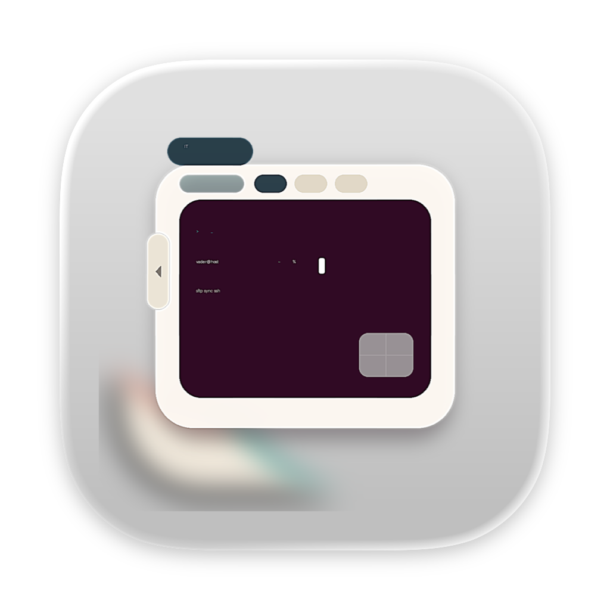

<div align="center">
  
  <h1>Integrate Terminal</h1>
  <p>Go, Wails, React 및 TypeScript로 개발한 다중 프로토콜 데스크톱 터미널 및 파일 전송 도구입니다.</p>
</div>

<p align="center">
  <a href="README.md">繁體中文</a> |
  <a href="README.en.md">English</a> |
  <a href="README.ja.md">日本語</a> |
  <a href="README.ko.md">한국어</a>
</p>

## 기능

- SSH, Telnet 및 로컬 Shell 터미널(로컬 Shell은 macOS와 Linux에서 지원).
- SFTP 및 FTP 파일 탐색과 전송 대기열.
- 사이트 그룹, 탭 복원, ZIP 백업 및 복원.
- AI 및 자동화 도구 연동을 위한 로컬 MCP Streamable HTTP Server.
- 백그라운드 서비스 및 시스템 트레이 상태 제어.
- 영어, 일본어, 한국어, 번체 중국어 및 간체 중국어 인터페이스.

## 오픈 소스 버전

오픈 소스 버전은 StoreKit을 사용하지 않고 연결 수를 제한하지 않으며 App Sandbox를 활성화하지 않습니다. 애플리케이션은 현재 로그인한 사용자 계정에 원래 접근 권한이 있는 파일과 디렉터리에 접근할 수 있습니다. 단, macOS의 개인정보 보호 대상 위치에서는 시스템이 사용자에게 권한을 요청할 수 있습니다.

처음 실행할 때 이전 샌드박스 버전의 사이트, 설정, known hosts, PPK 복사본 및 REST API 토큰 마이그레이션을 시도합니다. 공개 소스 코드에는 Apple 서명 인증서, Provisioning Profile, 개인 키 또는 개인 사이트 데이터가 포함되지 않습니다.

## MCP 연동

IntegTERM은 Streamable HTTP를 사용하는 표준 MCP Server를 내장합니다. MCP 호환 AI 및 자동화 클라이언트에서 저장된 사이트 관리, SSH, Telnet, SFTP, FTP 및 macOS/Linux 로컬 터미널 탭 열기, SSH 명령 실행, 대화형 터미널 제어, 파일 전송, 전송 대기열 및 실행 로그 조회를 수행할 수 있습니다.

### MCP Server 활성화

1. IntegTERM을 실행하고 **설정** → **MCP**를 엽니다.
2. 수신 포트와 IP 허용 목록을 확인합니다. 기본 포트는 `18080`이며 기본 허용 목록은 `127.0.0.1`입니다.
3. MCP Server를 활성화합니다. 기본 엔드포인트는 `http://127.0.0.1:18080/mcp`입니다.

### MCP 클라이언트 설정

```json
{
  "mcpServers": {
    "integterm": {
      "type": "streamable-http",
      "url": "http://127.0.0.1:18080/mcp"
    }
  }
}
```

MCP 엔드포인트에는 API token이나 사용자 지정 인증 헤더가 필요하지 않으며 접근 제어는 소스 IP/CIDR 허용 목록에 전적으로 의존합니다. 신뢰할 수 있는 원격 클라이언트의 연결이 반드시 필요한 경우가 아니라면 기본값인 `127.0.0.1`을 유지하고 불필요하게 넓은 네트워크를 추가하지 마십시오. App 내 MCP 페이지에는 현재 엔드포인트와 실행 중인 설정에서 생성된 전체 도구 문서가 표시됩니다. 클라이언트는 도구를 사용하기 전에 `tools/list`를 호출하여 현재 스키마를 확인해야 합니다.

## 개발 환경

- Apple Silicon 기반 macOS 12 이상, Windows 10/11 x64 또는 Linux x64
- Go 1.23 이상
- Node.js 및 npm
- macOS 빌드용 Xcode Command Line Tools
- Linux 빌드용 GTK3, WebKitGTK, AppIndicator 및 `pkg-config`
- 프로젝트 스크립트는 `go.mod`에 선언된 Wails v2 CLI 버전을 자동으로 사용합니다.

## 개발 모드 실행

```bash
git clone https://github.com/VaderChen/Integrate-Terminal.git
cd Integrate-Terminal
./run.sh
```

`run.sh`는 로컬 임시 디렉터리에 개발용 미러를 생성하여 외장 드라이브에서 만들어지는 AppleDouble 파일이 Wails 빌드를 방해하지 않도록 합니다.

## 데스크톱 실행 파일 빌드

### macOS Apple Silicon

```bash
./build.sh
```

출력 파일은 `build/bin/IntegTERM.app`에 생성됩니다. 기본적으로 ad-hoc 서명을 사용하고 App Sandbox를 활성화하지 않으므로 빌드 완료 후 로컬에서 바로 실행할 수 있습니다.

### Windows x64

```powershell
powershell -ExecutionPolicy Bypass -File .\build-windows.ps1
```

출력 파일은 `build\bin\IntegTERM.exe`에 생성됩니다. 스크립트는 x64 실행 파일만 만들며 설치 프로그램 생성이나 서명은 수행하지 않습니다.

### Linux x64

```bash
./build-linux.sh
```

출력 파일은 `build/bin/IntegTERM`에 생성됩니다. 스크립트는 설치된 WebKitGTK와 AppIndicator 버전을 감지하며 AppImage, DEB 또는 RPM 없이 x64 실행 파일만 생성합니다.

GitHub 공개 버전에는 Developer ID, Apple notarization, DMG 또는 다른 플랫폼용 배포 패키징 절차가 포함되지 않습니다. 서명, 설치 프로그램 및 배포 요구 사항은 배포자가 별도로 처리해야 합니다.

## 데이터 및 보안

애플리케이션 데이터는 각 플랫폼의 `os.UserConfigDir()` 아래 `IntegTERM` 디렉터리에 저장됩니다. 예를 들어 macOS에서는 `~/Library/Application Support/IntegTERM`, Windows에서는 `%AppData%\IntegTERM`, Linux에서는 `~/.config/IntegTERM`입니다. 사이트 비밀번호와 PPK 암호 문구는 현재 로컬 사이트 데이터 및 사이트 백업 ZIP 파일에 저장됩니다. 파일 권한을 제한하고 백업을 안전하게 보관하십시오. REST/MCP 서비스는 기본적으로 `127.0.0.1`에만 바인딩됩니다. 외부 연결을 허용하기 전에 IP 허용 목록을 올바르게 설정하십시오.

`cert/`, `data/`, `.env*`, 설치 패키지, 서명 자산 또는 실제 인증 정보가 포함된 파일을 커밋하지 마십시오. 보안 문제 신고 방법은 [SECURITY.md](SECURITY.md)를 참조하십시오.

## 라이선스

이 프로젝트는 이중 라이선스를 사용합니다.

1. 오픈 소스 사용에는 [GNU General Public License v3.0](LICENSE)이 적용됩니다.
2. GPLv3를 준수할 수 없거나 비공개 소스 통합 또는 기타 상업적 조건이 필요한 경우 별도의 [상업용 라이선스](COMMERCIAL-LICENSE.md)를 이용할 수 있습니다.

상업용 라이선스는 라이선스 제공자가 별도로 라이선스할 권리를 가진 코드와 자산에만 적용됩니다. 타사 패키지, 아이콘, 글꼴, 데이터 세트, AI 모델 및 기타 타사 콘텐츠는 포함되지 않으며 각각의 라이선스 조건이 계속 적용됩니다. 전체 목록은 [THIRD-PARTY-NOTICES.md](THIRD-PARTY-NOTICES.md)와 [THIRD-PARTY-LICENSES.txt](THIRD-PARTY-LICENSES.txt)를 참조하십시오.

빌드 과정은 GPLv3 전문, 타사 라이선스 문서 및 `build-metadata.json`을 배포 결과물에 포함합니다. 메타데이터에는 소스 Git tag, commit 및 작업 트리 상태가 기록되어 바이너리를 해당 소스 리비전으로 추적할 수 있습니다.

정식 Contributor License Agreement가 마련되기 전까지는 문제 보고와 토론만 받습니다. 자세한 내용은 [CONTRIBUTING.md](CONTRIBUTING.md)를 참조하십시오.
